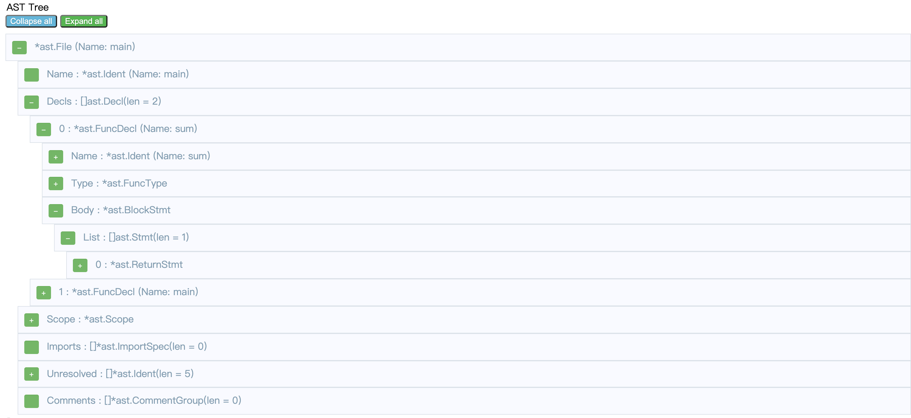
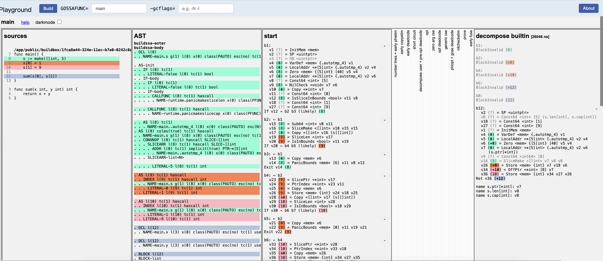
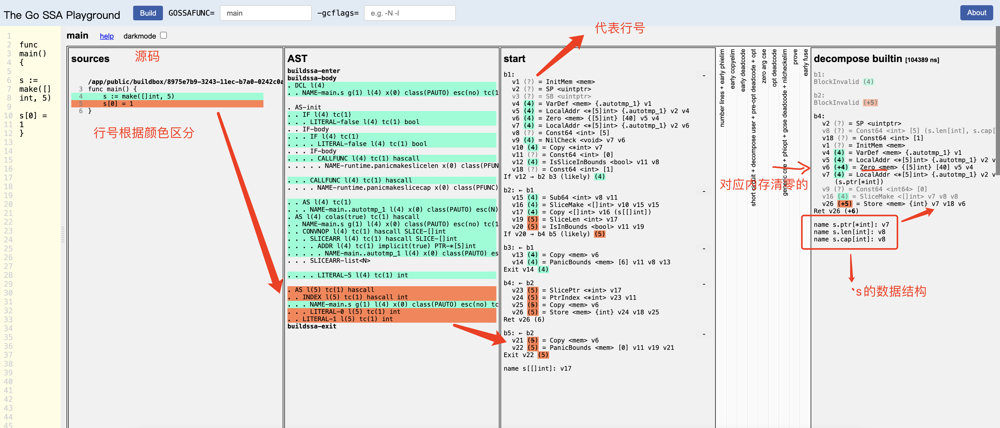

# go编译器和链接器
主要通过分析编译过程,学习go语法分析,中间代码与汇编的转换,最终破除Go的语法糖,从编译器与汇编角度真正理解Go语言.  

[Go编译器官方说明](https://github.com/golang/go/tree/master/src/cmd/compile)  
[Go编译器官方文档机翻](./go-compiler.md)  
[编译器知识:《自制编译器》](develop-compiler.md)  

# demo编译过程分析  

代码在根目录: demo.go  
```
package main

func sum(x int,y int) int {
	return x + y
}

func main() {
	s := make([]int, 5)
	s[0] = 1
	s[1] = 9

	sum(s[0], s[1])
}
```

## go 编译指令简介  

go build 指令常用参数
```
$ go help build  

The build flags are shared by the build, clean, get, install, list, run,
and test commands:

	-a
		force rebuilding of packages that are already up-to-date.
	-n
		print the commands but do not run them.
	-p n
		the number of programs, such as build commands or
		test binaries, that can be run in parallel.
		The default is GOMAXPROCS, normally the number of CPUs available.
	-race
		enable data race detection.
		Supported only on linux/amd64, freebsd/amd64, darwin/amd64, windows/amd64,
		linux/ppc64le and linux/arm64 (only for 48-bit VMA).
	-msan
		enable interoperation with memory sanitizer.
		Supported only on linux/amd64, linux/arm64
		and only with Clang/LLVM as the host C compiler.
		On linux/arm64, pie build mode will be used.
	-v
		print the names of packages as they are compiled.
	-work
		print the name of the temporary work directory and
		do not delete it when exiting.
	-x
		print the commands.

```

输出编译过程及文件  
```
$ go build -x -work  demo.go   

WORK=/var/folders/1g/cxqzw10d5vz2c8npwkkm1cfr0000gn/T/go-build1523506390
mkdir -p $WORK/b001/
cat >$WORK/b001/importcfg.link << 'EOF' # internal
packagefile command-line-arguments=/Users/zero/Library/Caches/go-build/13/13db8eaff8e9308791b824dd51ba589fa4efe242ae932849962521d5b97677c3-d
packagefile fmt=/Users/zero/go/sdk/go1.16.9/pkg/darwin_amd64/fmt.a
...
EOF
mkdir -p $WORK/b001/exe/
cd .
/Users/zero/go/sdk/go1.16.9/pkg/tool/darwin_amd64/link -o $WORK/b001/exe/a.out -importcfg $WORK/b001/importcfg.link -buildmode=exe -buildid=EpmhAIqOPGpJ3Qm4BqAq/S1sH1pm351_b1Cjcp1jh/iibyKbRQoYoSEzgSenAu/EpmhAIqOPGpJ3Qm4BqAq -extld=clang /Users/zero/Library/Caches/go-build/13/13db8eaff8e9308791b824dd51ba589fa4efe242ae932849962521d5b97677c3-d
/Users/zero/go/sdk/go1.16.9/pkg/tool/darwin_amd64/buildid -w $WORK/b001/exe/a.out # internal
mv $WORK/b001/exe/a.out hello
```

work目录的文件结构如下:  
```
└── b001
    ├── exe              //存储exe文件 exe/a.out 
    └── importcfg.link   //存储packagefile文件路径
```

主要的编译指令有两个: **link, buildid**  , 对应源码分别为:
- src/cmd/link/main.go、src/cmd/link/doc.go
- src/cmd/buildid/buildid.go  

```
/Users/zero/go/sdk/go1.16.9/pkg/tool/darwin_amd64/link -o $WORK/b001/exe/a.out -importcfg $WORK/b001/importcfg.link -buildmode=exe -buildid=EpmhAIqOPGpJ3Qm4BqAq/S1sH1pm351_b1Cjcp1jh/iibyKbRQoYoSEzgSenAu/EpmhAIqOPGpJ3Qm4BqAq -extld=clang /Users/zero/Library/Caches/go-build/13/13db8eaff8e9308791b824dd51ba589fa4efe242ae932849962521d5b97677c3-d
/Users/zero/go/sdk/go1.16.9/pkg/tool/darwin_amd64/buildid -w $WORK/b001/exe/a.out # internal

link 常用参数
├── -o file
|        write output to file
├── -importcfg file
|         read import configuration from file
├── -buildmode mode
|         set build mode
├── -buildid id
|        record id as Go toolchain build id 
查看buildid文件中,可看到: build id "S1sH1pm351_b1Cjcp1jh/iibyKbRQoYoSEzgSenAu"字样  

buildid 用法
usage: go tool buildid [-w] file
  -w    write build ID
```

## go编译过程介绍  
1. [语法分析]逐行扫描源代码,将之转换为一系列的token，交给parser解析。
2. [语义分析]parser: 它将一系列token转换为AST(抽象语法树), 用于下一步生成代码。
3. [中间代码及生成]最后一步, 代码生成, 会利用上一步生成的AST并根据目标机器平台的不同，生成目标机器码。
> 注意：下面使用的代码包（go/scanner，go/parser，go/token，go/ast）主要是让我们可以方便地对 Go 代码进行解析和生成，做出更有趣的事情。但是 Go 本身的编译器并不是用这些代码包实现的。

[Go语法树分析](https://github.com/ymm135/go-ast-book)  
[Go程序编译成目标机器码](https://segmentfault.com/a/1190000016523685)  

### 语法分析  
为了运行Go的程序，首先要对代码进行解析(parse)，也成为语法分析(syntax analyzing)。解析代码的程序模块成为解析器(parser)
或语法分析器(syntax analyzer)。  
  
那么“易于计算机理解的形式”究竟是怎样的形式呢？那就是称为语法树(syntax tree)的
形式。顾名思义，**语法树是树状的构造**。  


```
package main

import (
	"fmt"
	"go/scanner"
	"go/token"
	"io/ioutil"
)

func main() {

	// 读取demo.go 文件内容
	filepath := "/Users/zero/work/go/workspace/go-build/demo.go"
	src, err := ioutil.ReadFile(filepath)

	if err != nil {
		panic(err)
	}

	var s scanner.Scanner
	fset := token.NewFileSet()
	file := fset.AddFile("", fset.Base(), len(src))
	s.Init(file, src, nil, 0)

	for {
		pos, tok, lit := s.Scan()
		fmt.Printf("%-6s%-8s%q\n", fset.Position(pos), tok, lit)

		if tok == token.EOF {
			break
		}
	}
}
```

语法树结果输出:   
```
1:1   package "package"
1:9   IDENT   "main"
1:13  ;       "\n"
3:1   func    "func"
3:6   IDENT   "sum"
3:9   (       ""
3:10  IDENT   "x"
3:27  {       ""
4:2   return  "return"
4:9   IDENT   "x"
4:11  +       ""
4:13  IDENT   "y"
4:14  ;       "\n"
5:1   }       ""
5:2   ;       "\n"
7:1   func    "func"
7:6   IDENT   "main"
7:10  (       ""
7:11  )       ""
7:13  {       ""
8:2   IDENT   "s"
8:4   :=      ""
8:7   IDENT   "make"
8:11  (       ""
8:12  [       ""
8:13  ]       ""
8:14  IDENT   "int"
8:17  ,       ""
8:19  INT     "5"
8:20  )       ""
8:21  ;       "\n"
9:2   IDENT   "s"
9:3   [       ""
9:4   INT     "0"
9:5   ]       ""
9:7   =       ""
9:9   INT     "1"
9:10  ;       "\n"
10:2  IDENT   "s"
10:3  [       ""
10:4  INT     "1"
10:5  ]       ""
10:7  =       ""
10:9  INT     "9"
10:10 ;       "\n"
12:2  IDENT   "sum"
12:5  (       ""
12:6  IDENT   "s"
12:7  [       ""
12:8  INT     "0"
12:9  ]       ""
12:10 ,       ""
12:12 IDENT   "s"
12:13 [       ""
12:14 INT     "1"
12:15 ]       ""
12:16 )       ""
12:17 ;       "\n"
13:1  }       ""
13:2  ;       "\n"
13:2  EOF     ""
```

### 语义分析 
通过解析代码获得语法树后，接着就要解析语法树，除去多余的内容，添加必要的信息。 
生成抽象语法树（Abstract Syntax Tree，AST）这样一种数据结构。上述处理就是语义分析semantic analysis）

可以使用 [GoAST Viewer](https://yuroyoro.github.io/goast-viewer/) 进行在线生成树结构   
<br> 
  
<br>

也可以使用Go代码生成AST:  
```
package main

import (
	"go/ast"
	"go/parser"
	"go/token"
	"io/ioutil"
	"log"
)

func main() {
	// 读取demo.go 文件内容
	filepath := "/Users/zero/work/go/workspace/go-build/demo.go"
	src, err := ioutil.ReadFile(filepath)

	if err != nil {
		panic(err)
	}

	fset := token.NewFileSet()

	file, err := parser.ParseFile(fset, "", src, 0)
	if err != nil {
		log.Fatal(err)
	}

	ast.Print(fset, file)
}
```

结果输出:    
```
     0  *ast.File {
     1  .  Package: 1:1
     2  .  Name: *ast.Ident {
     3  .  .  NamePos: 1:9
     4  .  .  Name: "main"
     5  .  }
     6  .  Decls: []ast.Decl (len = 2) {
     7  .  .  0: *ast.FuncDecl {
     8  .  .  .  Name: *ast.Ident {
     9  .  .  .  .  NamePos: 3:6
    10  .  .  .  .  Name: "sum"
    11  .  .  .  .  Obj: *ast.Object {
    12  .  .  .  .  .  Kind: func
    13  .  .  .  .  .  Name: "sum"
    14  .  .  .  .  .  Decl: *(obj @ 7)
    15  .  .  .  .  }
    16  .  .  .  }
    17  .  .  .  Type: *ast.FuncType {
    18  .  .  .  .  Func: 3:1
    19  .  .  .  .  Params: *ast.FieldList {
    20  .  .  .  .  .  Opening: 3:9
    21  .  .  .  .  .  List: []*ast.Field (len = 2) {
    22  .  .  .  .  .  .  0: *ast.Field {
    23  .  .  .  .  .  .  .  Names: []*ast.Ident (len = 1) {
    24  .  .  .  .  .  .  .  .  0: *ast.Ident {
    25  .  .  .  .  .  .  .  .  .  NamePos: 3:10
    26  .  .  .  .  .  .  .  .  .  Name: "x"
    27  .  .  .  .  .  .  .  .  .  Obj: *ast.Object {
    28  .  .  .  .  .  .  .  .  .  .  Kind: var
    29  .  .  .  .  .  .  .  .  .  .  Name: "x"
    30  .  .  .  .  .  .  .  .  .  .  Decl: *(obj @ 22)
    31  .  .  .  .  .  .  .  .  .  }
    32  .  .  .  .  .  .  .  .  }
    33  .  .  .  .  .  .  .  }
    34  .  .  .  .  .  .  .  Type: *ast.Ident {
    35  .  .  .  .  .  .  .  .  NamePos: 3:12
    36  .  .  .  .  .  .  .  .  Name: "int"
    37  .  .  .  .  .  .  .  }
    38  .  .  .  .  .  .  }
    39  .  .  .  .  .  .  1: *ast.Field {
    40  .  .  .  .  .  .  .  Names: []*ast.Ident (len = 1) {
    41  .  .  .  .  .  .  .  .  0: *ast.Ident {
    42  .  .  .  .  .  .  .  .  .  NamePos: 3:16
    43  .  .  .  .  .  .  .  .  .  Name: "y"
    44  .  .  .  .  .  .  .  .  .  Obj: *ast.Object {
    45  .  .  .  .  .  .  .  .  .  .  Kind: var
    46  .  .  .  .  .  .  .  .  .  .  Name: "y"
    47  .  .  .  .  .  .  .  .  .  .  Decl: *(obj @ 39)
    48  .  .  .  .  .  .  .  .  .  }
    49  .  .  .  .  .  .  .  .  }
    50  .  .  .  .  .  .  .  }
    51  .  .  .  .  .  .  .  Type: *ast.Ident {
    52  .  .  .  .  .  .  .  .  NamePos: 3:18
    53  .  .  .  .  .  .  .  .  Name: "int"
    54  .  .  .  .  .  .  .  }
    55  .  .  .  .  .  .  }
    56  .  .  .  .  .  }
    57  .  .  .  .  .  Closing: 3:21
    58  .  .  .  .  }
    59  .  .  .  .  Results: *ast.FieldList {
    60  .  .  .  .  .  Opening: -
    61  .  .  .  .  .  List: []*ast.Field (len = 1) {
    62  .  .  .  .  .  .  0: *ast.Field {
    63  .  .  .  .  .  .  .  Type: *ast.Ident {
    64  .  .  .  .  .  .  .  .  NamePos: 3:23
    65  .  .  .  .  .  .  .  .  Name: "int"
    66  .  .  .  .  .  .  .  }
    67  .  .  .  .  .  .  }
    68  .  .  .  .  .  }
    69  .  .  .  .  .  Closing: -
    70  .  .  .  .  }
    71  .  .  .  }
    72  .  .  .  Body: *ast.BlockStmt {
    73  .  .  .  .  Lbrace: 3:27
    74  .  .  .  .  List: []ast.Stmt (len = 1) {
    75  .  .  .  .  .  0: *ast.ReturnStmt {
    76  .  .  .  .  .  .  Return: 4:2
    77  .  .  .  .  .  .  Results: []ast.Expr (len = 1) {
    78  .  .  .  .  .  .  .  0: *ast.BinaryExpr {
    79  .  .  .  .  .  .  .  .  X: *ast.Ident {
    80  .  .  .  .  .  .  .  .  .  NamePos: 4:9
    81  .  .  .  .  .  .  .  .  .  Name: "x"
    82  .  .  .  .  .  .  .  .  .  Obj: *(obj @ 27)
    83  .  .  .  .  .  .  .  .  }
    84  .  .  .  .  .  .  .  .  OpPos: 4:11
    85  .  .  .  .  .  .  .  .  Op: +
    86  .  .  .  .  .  .  .  .  Y: *ast.Ident {
    87  .  .  .  .  .  .  .  .  .  NamePos: 4:13
    88  .  .  .  .  .  .  .  .  .  Name: "y"
    89  .  .  .  .  .  .  .  .  .  Obj: *(obj @ 44)
    90  .  .  .  .  .  .  .  .  }
    91  .  .  .  .  .  .  .  }
    92  .  .  .  .  .  .  }
    93  .  .  .  .  .  }
    94  .  .  .  .  }
    95  .  .  .  .  Rbrace: 5:1
    96  .  .  .  }
    97  .  .  }
    98  .  .  1: *ast.FuncDecl {
    99  .  .  .  Name: *ast.Ident {
   100  .  .  .  .  NamePos: 7:6
   101  .  .  .  .  Name: "main"
   102  .  .  .  .  Obj: *ast.Object {
   103  .  .  .  .  .  Kind: func
   104  .  .  .  .  .  Name: "main"
   105  .  .  .  .  .  Decl: *(obj @ 98)
   106  .  .  .  .  }
   107  .  .  .  }
   108  .  .  .  Type: *ast.FuncType {
   109  .  .  .  .  Func: 7:1
   110  .  .  .  .  Params: *ast.FieldList {
   111  .  .  .  .  .  Opening: 7:10
   112  .  .  .  .  .  Closing: 7:11
   113  .  .  .  .  }
   114  .  .  .  }
   115  .  .  .  Body: *ast.BlockStmt {
   116  .  .  .  .  Lbrace: 7:13
   117  .  .  .  .  List: []ast.Stmt (len = 4) {
   118  .  .  .  .  .  0: *ast.AssignStmt {
   119  .  .  .  .  .  .  Lhs: []ast.Expr (len = 1) {
   120  .  .  .  .  .  .  .  0: *ast.Ident {
   121  .  .  .  .  .  .  .  .  NamePos: 8:2
   122  .  .  .  .  .  .  .  .  Name: "s"
   123  .  .  .  .  .  .  .  .  Obj: *ast.Object {
   124  .  .  .  .  .  .  .  .  .  Kind: var
   125  .  .  .  .  .  .  .  .  .  Name: "s"
   126  .  .  .  .  .  .  .  .  .  Decl: *(obj @ 118)
   127  .  .  .  .  .  .  .  .  }
   128  .  .  .  .  .  .  .  }
   129  .  .  .  .  .  .  }
   130  .  .  .  .  .  .  TokPos: 8:4
   131  .  .  .  .  .  .  Tok: :=
   132  .  .  .  .  .  .  Rhs: []ast.Expr (len = 1) {
   133  .  .  .  .  .  .  .  0: *ast.CallExpr {
   134  .  .  .  .  .  .  .  .  Fun: *ast.Ident {
   135  .  .  .  .  .  .  .  .  .  NamePos: 8:7
   136  .  .  .  .  .  .  .  .  .  Name: "make"
   137  .  .  .  .  .  .  .  .  }
   138  .  .  .  .  .  .  .  .  Lparen: 8:11
   139  .  .  .  .  .  .  .  .  Args: []ast.Expr (len = 2) {
   140  .  .  .  .  .  .  .  .  .  0: *ast.ArrayType {
   141  .  .  .  .  .  .  .  .  .  .  Lbrack: 8:12
   142  .  .  .  .  .  .  .  .  .  .  Elt: *ast.Ident {
   143  .  .  .  .  .  .  .  .  .  .  .  NamePos: 8:14
   144  .  .  .  .  .  .  .  .  .  .  .  Name: "int"
   145  .  .  .  .  .  .  .  .  .  .  }
   146  .  .  .  .  .  .  .  .  .  }
   147  .  .  .  .  .  .  .  .  .  1: *ast.BasicLit {
   148  .  .  .  .  .  .  .  .  .  .  ValuePos: 8:19
   149  .  .  .  .  .  .  .  .  .  .  Kind: INT
   150  .  .  .  .  .  .  .  .  .  .  Value: "5"
   151  .  .  .  .  .  .  .  .  .  }
   152  .  .  .  .  .  .  .  .  }
   153  .  .  .  .  .  .  .  .  Ellipsis: -
   154  .  .  .  .  .  .  .  .  Rparen: 8:20
   155  .  .  .  .  .  .  .  }
   156  .  .  .  .  .  .  }
   157  .  .  .  .  .  }
   158  .  .  .  .  .  1: *ast.AssignStmt {
   159  .  .  .  .  .  .  Lhs: []ast.Expr (len = 1) {
   160  .  .  .  .  .  .  .  0: *ast.IndexExpr {
   161  .  .  .  .  .  .  .  .  X: *ast.Ident {
   162  .  .  .  .  .  .  .  .  .  NamePos: 9:2
   163  .  .  .  .  .  .  .  .  .  Name: "s"
   164  .  .  .  .  .  .  .  .  .  Obj: *(obj @ 123)
   165  .  .  .  .  .  .  .  .  }
   166  .  .  .  .  .  .  .  .  Lbrack: 9:3
   167  .  .  .  .  .  .  .  .  Index: *ast.BasicLit {
   168  .  .  .  .  .  .  .  .  .  ValuePos: 9:4
   169  .  .  .  .  .  .  .  .  .  Kind: INT
   170  .  .  .  .  .  .  .  .  .  Value: "0"
   171  .  .  .  .  .  .  .  .  }
   172  .  .  .  .  .  .  .  .  Rbrack: 9:5
   173  .  .  .  .  .  .  .  }
   174  .  .  .  .  .  .  }
   175  .  .  .  .  .  .  TokPos: 9:7
   176  .  .  .  .  .  .  Tok: =
   177  .  .  .  .  .  .  Rhs: []ast.Expr (len = 1) {
   178  .  .  .  .  .  .  .  0: *ast.BasicLit {
   179  .  .  .  .  .  .  .  .  ValuePos: 9:9
   180  .  .  .  .  .  .  .  .  Kind: INT
   181  .  .  .  .  .  .  .  .  Value: "1"
   182  .  .  .  .  .  .  .  }
   183  .  .  .  .  .  .  }
   184  .  .  .  .  .  }
   185  .  .  .  .  .  2: *ast.AssignStmt {
   186  .  .  .  .  .  .  Lhs: []ast.Expr (len = 1) {
   187  .  .  .  .  .  .  .  0: *ast.IndexExpr {
   188  .  .  .  .  .  .  .  .  X: *ast.Ident {
   189  .  .  .  .  .  .  .  .  .  NamePos: 10:2
   190  .  .  .  .  .  .  .  .  .  Name: "s"
   191  .  .  .  .  .  .  .  .  .  Obj: *(obj @ 123)
   192  .  .  .  .  .  .  .  .  }
   193  .  .  .  .  .  .  .  .  Lbrack: 10:3
   194  .  .  .  .  .  .  .  .  Index: *ast.BasicLit {
   195  .  .  .  .  .  .  .  .  .  ValuePos: 10:4
   196  .  .  .  .  .  .  .  .  .  Kind: INT
   197  .  .  .  .  .  .  .  .  .  Value: "1"
   198  .  .  .  .  .  .  .  .  }
   199  .  .  .  .  .  .  .  .  Rbrack: 10:5
   200  .  .  .  .  .  .  .  }
   201  .  .  .  .  .  .  }
   202  .  .  .  .  .  .  TokPos: 10:7
   203  .  .  .  .  .  .  Tok: =
   204  .  .  .  .  .  .  Rhs: []ast.Expr (len = 1) {
   205  .  .  .  .  .  .  .  0: *ast.BasicLit {
   206  .  .  .  .  .  .  .  .  ValuePos: 10:9
   207  .  .  .  .  .  .  .  .  Kind: INT
   208  .  .  .  .  .  .  .  .  Value: "9"
   209  .  .  .  .  .  .  .  }
   210  .  .  .  .  .  .  }
   211  .  .  .  .  .  }
   212  .  .  .  .  .  3: *ast.ExprStmt {
   213  .  .  .  .  .  .  X: *ast.CallExpr {
   214  .  .  .  .  .  .  .  Fun: *ast.Ident {
   215  .  .  .  .  .  .  .  .  NamePos: 12:2
   216  .  .  .  .  .  .  .  .  Name: "sum"
   217  .  .  .  .  .  .  .  .  Obj: *(obj @ 11)
   218  .  .  .  .  .  .  .  }
   219  .  .  .  .  .  .  .  Lparen: 12:5
   220  .  .  .  .  .  .  .  Args: []ast.Expr (len = 2) {
   221  .  .  .  .  .  .  .  .  0: *ast.IndexExpr {
   222  .  .  .  .  .  .  .  .  .  X: *ast.Ident {
   223  .  .  .  .  .  .  .  .  .  .  NamePos: 12:6
   224  .  .  .  .  .  .  .  .  .  .  Name: "s"
   225  .  .  .  .  .  .  .  .  .  .  Obj: *(obj @ 123)
   226  .  .  .  .  .  .  .  .  .  }
   227  .  .  .  .  .  .  .  .  .  Lbrack: 12:7
   228  .  .  .  .  .  .  .  .  .  Index: *ast.BasicLit {
   229  .  .  .  .  .  .  .  .  .  .  ValuePos: 12:8
   230  .  .  .  .  .  .  .  .  .  .  Kind: INT
   231  .  .  .  .  .  .  .  .  .  .  Value: "0"
   232  .  .  .  .  .  .  .  .  .  }
   233  .  .  .  .  .  .  .  .  .  Rbrack: 12:9
   234  .  .  .  .  .  .  .  .  }
   235  .  .  .  .  .  .  .  .  1: *ast.IndexExpr {
   236  .  .  .  .  .  .  .  .  .  X: *ast.Ident {
   237  .  .  .  .  .  .  .  .  .  .  NamePos: 12:12
   238  .  .  .  .  .  .  .  .  .  .  Name: "s"
   239  .  .  .  .  .  .  .  .  .  .  Obj: *(obj @ 123)
   240  .  .  .  .  .  .  .  .  .  }
   241  .  .  .  .  .  .  .  .  .  Lbrack: 12:13
   242  .  .  .  .  .  .  .  .  .  Index: *ast.BasicLit {
   243  .  .  .  .  .  .  .  .  .  .  ValuePos: 12:14
   244  .  .  .  .  .  .  .  .  .  .  Kind: INT
   245  .  .  .  .  .  .  .  .  .  .  Value: "1"
   246  .  .  .  .  .  .  .  .  .  }
   247  .  .  .  .  .  .  .  .  .  Rbrack: 12:15
   248  .  .  .  .  .  .  .  .  }
   249  .  .  .  .  .  .  .  }
   250  .  .  .  .  .  .  .  Ellipsis: -
   251  .  .  .  .  .  .  .  Rparen: 12:16
   252  .  .  .  .  .  .  }
   253  .  .  .  .  .  }
   254  .  .  .  .  }
   255  .  .  .  .  Rbrace: 13:1
   256  .  .  .  }
   257  .  .  }
   258  .  }
   259  .  Scope: *ast.Scope {
   260  .  .  Objects: map[string]*ast.Object (len = 2) {
   261  .  .  .  "main": *(obj @ 102)
   262  .  .  .  "sum": *(obj @ 11)
   263  .  .  }
   264  .  }
   265  .  Unresolved: []*ast.Ident (len = 5) {
   266  .  .  0: *(obj @ 34)
   267  .  .  1: *(obj @ 51)
   268  .  .  2: *(obj @ 63)
   269  .  .  3: *(obj @ 134)
   270  .  .  4: *(obj @ 142)
   271  .  }
   272  }
```


### 中间代码及生成  

本地生成ssa文件ssa.html  
```
GOSSAFUNC=main GOOS=linux GOARCH=amd64 go build -gcflags -S demo.go  
```

这里使用在线工具生成  
  


ssa中操作码(opcodes)的定义在 [genericOps.go](https://github.com/golang/go/blob/master/src/cmd/compile/internal/ssa/gen/genericOps.go) 
其中`gen/*`包下还有各种平台实现,比如AMD64平台:  
- AMD64Ops.go => AMD64平台的操作指令 
- AMD64.rules => 通过规则文件进行简单优化  
- AMD64splitload.rules  
  
  
这里列举这个操作的解析:  
```
// Note: ConstX are sign-extended even when the type of the value is unsigned.
// For instance, uint8(0xaa) is stored as auxint=0xffffffffffffffaa.
{name: "Const64", aux: "Int64"}, // value is auxint

//接收的参数只有一个(argLength), 定义变量并初始化: v4 (8) = VarDef <mem> {.autotmp_4} v1    
{name: "VarDef", argLength: 1, aux: "Sym", typ: "Mem", symEffect: "None", zeroWidth: true}, // aux is a *gc.Node of a variable that is about to be initialized.  arg0=mem, returns mem

// Constant-like things
{name: "InitMem", zeroWidth: true},                               // memory input to the function.
{name: "Arg", aux: "SymOff", symEffect: "Read", zeroWidth: true}, // argument to the function.  aux=GCNode of arg, off = offset in that arg.// The address of a variable.  arg0 is the base pointer.

// If the variable is a global, the base pointer will be SB and
// the Aux field will be a *obj.LSym.
// If the variable is a local, the base pointer will be SP and
// the Aux field will be a *gc.Node.
{name: "Addr", argLength: 1, aux: "Sym", symEffect: "Addr"},      // Address of a variable.  Arg0=SB.  Aux identifies the variable.
{name: "LocalAddr", argLength: 2, aux: "Sym", symEffect: "Addr"}, // Address of a variable.  Arg0=SP. Arg1=mem. Aux identifies the variable.

{name: "SP", zeroWidth: true},                 // stack pointer
{name: "SB", typ: "Uintptr", zeroWidth: true}, // static base pointer (a.k.a. globals pointer)
{name: "Invalid"},                             // unused value

// Memory operations
{name: "Load", argLength: 2},                          // Load from arg0.  arg1=memory
{name: "Dereference", argLength: 2},                   // Load from arg0.  arg1=memory.  Helper op for arg/result passing, result is an otherwise not-SSA-able "value".
{name: "Store", argLength: 3, typ: "Mem", aux: "Typ"}, // Store arg1 to arg0.  arg2=memory, aux=type.  Returns memory.

```

- **ssa-start**代码注解  
sum函数的操作码:  
```
**start**

源码: 
 
/app/public/buildbox/9a502046-32e8-11ec-b7a0-0242c0a8d002/main.go
3 func sum(x int, y int) int {
4 	return x + y
5 }

b1:                                            //创建b1 block, 初始化方法栈
  v1 (?) = InitMem <mem>                       // 
  v2 (?) = SP <uintptr>                        //栈顶
  v3 (?) = SB <uintptr>                        //栈低
  v4 (?) = LocalAddr <*int> {x} v2 v1          //创建变量{x}并返回地址 ptr  
  v5 (?) = LocalAddr <*int> {y} v2 v1          // {y}
  v6 (?) = LocalAddr <*int> {~r2} v2 v1        // {~r2}
  v7 (3) = Arg <int> {x} (x[int])              // 获取参数x
  v8 (3) = Arg <int> {y} (y[int])              // 获取参数y
  v9 (?) = Const64 <int> [0]                   //常量0
  v10 (4) = Add64 <int> v7 v8                  // x + y
  v11 (4) = VarDef <mem> {~r2} v1              //
  v12 (4) = Store <mem> {int} v6 v10 v11       //Store arg1 to arg0.  arg2=memory, aux=type.  Returns memory. 把v10的值存储到v6指向的地址中, 并返回v6内存中的值  
Ret v12 (+4)

name x[int]: v7
name y[int]: v8
```

main函数的操作码:  
```
b1:                                                    //创建block b1, 相当于分配一段栈空间
  v1 (?) = InitMem <mem>                               //程序堆栈
  v2 (?) = SP <uintptr>                                //栈顶
  v3 (?) = SB <uintptr>                                //栈低
  v4 (8) = VarDef <mem> {.autotmp_4} v1                //arg0=mem, returns mem, 创建一个临时变量{.autotmp_4}
  v5 (8) = LocalAddr <*[5]int> {.autotmp_4} v2 v4      //Address of a variable. Arg0=SP. Arg1=mem. 获取{.autotmp_4}变量的地址
  v6 (8) = Zero <mem> {[5]int} [40] v5 v4              //arg0=destptr, arg1=mem, auxint=size, aux=type. Returns memory. 申请的是5x8=40个字节空间，初始化为0
  v7 (8) = LocalAddr <*[5]int> {.autotmp_4} v2 v6      // 
  v8 (?) = Const64 <int> [5]                           // 5常量, 切片大小   
  v9 (8) = NilCheck <void> v7 v6                       // arg0=ptr, arg1=mem. Panics if arg0 is nil. Returns void.
  v10 (8) = Copy <*int> v7                             // output = arg0, 返回v7的地址  
  v11 (?) = Const64 <int> [0]                          
  v12 (8) = IsSliceInBounds <bool> v11 v8              
  v18 (?) = Const64 <int> [1]
  v27 (?) = Const64 <int> [9]
If v12 → b2 b3 (likely) (8)                            // 如果v12(切片边界检查ok), 就调到b2 block

b2: ← b1
  v15 (8) = Sub64 <int> v8 v11                        // arg0 - arg1, 也就是5-0=5, 切片的大小
  v16 (8) = SliceMake <[]int> v10 v15 v15             // arg0=ptr, arg1=len, arg2=cap, 由此可以确认v10就是数组内存的首地址
  v17 (8) = Copy <[]int> v16 (s[[]int])               // 切片地址
  v19 (9) = SliceLen <int> v17                        // len(arg0)
  v20 (9) = IsInBounds <bool> v11 v19                 
  If v20 → b4 b5 (likely) (9)                        

b3: ← b1
  v13 (8) = Copy <mem> v6
  v14 (8) = PanicBounds <mem> [6] v11 v8 v13
Exit v14 (8)    

b4: ← b2  
  v23 (9) = SlicePtr <*int> v17                      // ptr(arg0), 获取切片中数组地址
  v24 (9) = PtrIndex <*int> v23 v11                  // 获取s[0]的地址,  arg0=ptr, arg1=index. Computes ptr+sizeof(*v.type)*index, where index is extended to ptrwidth type
  v25 (9) = Copy <mem> v6                            // 获取数组首地址
  v26 (9) = Store <mem> {int} v24 v18 v25            // s[0] = 1
  v28 (10) = Copy <[]int> v17 (s[[]int])             
  v29 (10) = SliceLen <int> v28
  v30 (10) = IsInBounds <bool> v18 v29
  If v30 → b6 b7 (likely) (10)                      // 每执行一步时都会做数组检查,如果出错就会跳转到panic

b5: ← b2
  v21 (9) = Copy <mem> v6
  v22 (9) = PanicBounds <mem> [0] v11 v19 v21
Exit v22 (9)             

b6: ← b4                                           // b6 block执行的语句是 s[1] = 9, 和b4 一样
  v33 (10) = SlicePtr <*int> v28                   
  v34 (10) = PtrIndex <*int> v33 v18
  v35 (10) = Copy <mem> v26                        
  v36 (10) = Store <mem> {int} v34 v27 v35         //把9存入的v36
  v37 (12) = Copy <[]int> v28 (s[[]int])
  v38 (12) = SliceLen <int> v37
  v39 (12) = IsInBounds <bool> v11 v38
  If v39 → b8 b9 (likely) (12)    

b7: ← b4
  v31 (10) = Copy <mem> v26
  v32 (10) = PanicBounds <mem> [0] v18 v29 v31
  Exit v32 (10) 

b8: ← b6
  v42 (12) = SlicePtr <*int> v37                  //获取切片的地址
  v43 (12) = PtrIndex <*int> v42 v11              //索引0
  v44 (12) = Copy <mem> v36                       //v36 = 9
  v45 (12) = Load <int> v43 v44 (x[int])          //Load from arg0.  arg1=memory, 把9赋给函数参数x
  v46 (12) = Copy <[]int> v37 (s[[]int])          //获取切片的地址
  v47 (12) = SliceLen <int> v46                   //获取切片的len
  v48 (12) = IsInBounds <bool> v18 v47            //v18=1, 0 <= arg0 < arg1, 1 是小于 5的
  If v48 → b10 b11 (likely) (12)                  //如果没有越界, 那就跳转到block10

b9: ← b6
  v40 (12) = Copy <mem> v36
  v41 (12) = PanicBounds <mem> [0] v11 v38 v40
  Exit v41 (12)    

b10: ← b8
  v51 (12) = SlicePtr <*int> v46                  //获取切片数组的地址  
  v52 (12) = PtrIndex <*int> v51 v18              //索引1, 相当于s[1]
  v53 (12) = Copy <mem> v44                       
  v54 (12) = Load <int> v52 v53 (y[int])          //把9赋给函数参数y
  v55 (+12) = InlMark <void> [0] v53              // InlMark marks the start of an inlined function body. Its AuxInt field, 检查函数是否越界
  v56 (4) = Copy <int> v45 (x[int])               // 获取x参数的值
  v57 (4) = Add64 <int> v56 v54 (~R0[int])        //把x与y相加, 并且赋给~R0变量,并返回
  Plain → b12 (+12)  

b11: ← b8
  v49 (12) = Copy <mem> v44
  v50 (12) = PanicBounds <mem> [0] v18 v47 v49
  Exit v50 (12)

b12: ← b10                                        //sum函数执行后跳转到这里,如果有变量接收sum的返回值: 
                                                  // v58 (14) = Copy <int> v57 (~R0[int]) 
  v58 (13) = Copy <mem> v53
  Ret v58 

name s[[]int]: v17 v28 v37 v46
name x[int]: v45 v56
name y[int]: v54
name ~R0[int]: v57
```

使用dlv查看demo.go的反汇编,如果ssa的指令有不清楚的，可以对照汇编指令  
```
(dlv) disass
TEXT main.main(SB) /Users/zero/work/go/workspace/go-build/demo.go
	demo.go:7	0x1058e00	493b6610		cmp rsp, qword ptr [r14+0x10]
	demo.go:7	0x1058e04	0f86bd000000		jbe 0x1058ec7
=>	demo.go:7	0x1058e0a*	4883ec68		sub rsp, 0x68
	demo.go:7	0x1058e0e	48896c2460		mov qword ptr [rsp+0x60], rbp
	demo.go:7	0x1058e13	488d6c2460		lea rbp, ptr [rsp+0x60]
	demo.go:8	0x1058e18	48c744242000000000	mov qword ptr [rsp+0x20], 0x0
	demo.go:8	0x1058e21	488d542428		lea rdx, ptr [rsp+0x28]
	demo.go:8	0x1058e26	440f113a		movups xmmword ptr [rdx], xmm15
	demo.go:8	0x1058e2a	488d542438		lea rdx, ptr [rsp+0x38]
	demo.go:8	0x1058e2f	440f113a		movups xmmword ptr [rdx], xmm15
	demo.go:8	0x1058e33	488d542420		lea rdx, ptr [rsp+0x20]
	demo.go:8	0x1058e38	8402			test byte ptr [rdx], al
	demo.go:8	0x1058e3a	eb00			jmp 0x1058e3c
	demo.go:8	0x1058e3c	4889542448		mov qword ptr [rsp+0x48], rdx
	demo.go:8	0x1058e41	48c744245005000000	mov qword ptr [rsp+0x50], 0x5
	demo.go:8	0x1058e4a	48c744245805000000	mov qword ptr [rsp+0x58], 0x5
	demo.go:9	0x1058e53	eb00			jmp 0x1058e55
	demo.go:9	0x1058e55	48c744242001000000	mov qword ptr [rsp+0x20], 0x1
	demo.go:10	0x1058e5e	488b542448		mov rdx, qword ptr [rsp+0x48]
	demo.go:10	0x1058e63	eb00			jmp 0x1058e65
	demo.go:10	0x1058e65	48c7420809000000	mov qword ptr [rdx+0x8], 0x9
	demo.go:12	0x1058e6d	488b4c2450		mov rcx, qword ptr [rsp+0x50]
	demo.go:12	0x1058e72	488b542448		mov rdx, qword ptr [rsp+0x48]
	demo.go:12	0x1058e77	4885c9			test rcx, rcx
	demo.go:12	0x1058e7a	7702			jnbe 0x1058e7e
	demo.go:12	0x1058e7c	eb41			jmp 0x1058ebf
	demo.go:12	0x1058e7e	488b12			mov rdx, qword ptr [rdx]
	demo.go:12	0x1058e81	4889542418		mov qword ptr [rsp+0x18], rdx
	demo.go:12	0x1058e86	488b4c2450		mov rcx, qword ptr [rsp+0x50]
	demo.go:12	0x1058e8b	488b542448		mov rdx, qword ptr [rsp+0x48]
	demo.go:12	0x1058e90	4883f901		cmp rcx, 0x1
	demo.go:12	0x1058e94	7702			jnbe 0x1058e98
	demo.go:12	0x1058e96	eb1d			jmp 0x1058eb5
	demo.go:12	0x1058e98	488b5a08		mov rbx, qword ptr [rdx+0x8]
	demo.go:12	0x1058e9c	48895c2410		mov qword ptr [rsp+0x10], rbx
	demo.go:12	0x1058ea1	488b442418		mov rax, qword ptr [rsp+0x18]
	demo.go:12	0x1058ea6	e815ffffff		call $main.sum
	demo.go:13	0x1058eab	488b6c2460		mov rbp, qword ptr [rsp+0x60]
	demo.go:13	0x1058eb0	4883c468		add rsp, 0x68
	demo.go:13	0x1058eb4	c3			ret
	demo.go:12	0x1058eb5	b801000000		mov eax, 0x1
	demo.go:12	0x1058eba	e861d7ffff		call $runtime.panicIndex
	demo.go:12	0x1058ebf	31c0			xor eax, eax
	demo.go:12	0x1058ec1	e85ad7ffff		call $runtime.panicIndex
	demo.go:12	0x1058ec6	90			nop
	demo.go:7	0x1058ec7	e8d4cfffff		call $runtime.morestack_noctxt
	.:0		0x1058ecc	e92fffffff		jmp $main.main
```

> 备注lea与mov的区别:  
> lea是“load effective address”的缩写，简单的说，lea指令可以用来将一个内存地址直接赋给目的操作数，例如：lea eax,[ebx+8]就是将ebx+8这个值直接赋给eax，而不是把ebx+8处的内存地址里的数据赋给eax。  
> 而mov指令则恰恰相反，例如：mov eax,[ebx+8]则是把内存地址为ebx+8处的数据赋给eax。  
  
> [ssa在线生成工具](https://golang.design/gossa?id=aa75c401-323e-11ec-b7a0-0242c0a8d002)  
>   


  