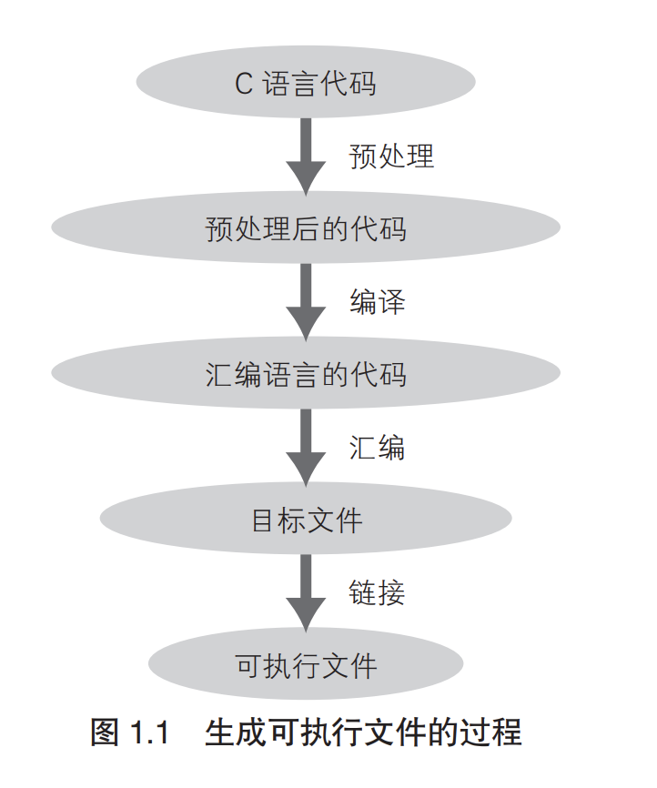
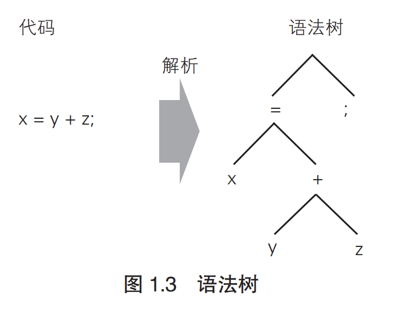

# 目录
- [自制编译器](#自制编译器)
- [第1章-开始制作编译器](#第1章-开始制作编译器)
- [第2章-cь和cbc](#第2章-cь和cbc)
- [第3章-语法分析的概要](#第3章-语法分析的概要)
- [第4章-词法分析](#第4章-词法分析)
- [第5章-基于javacc的解析器的描述](#第5章-基于javacc的解析器的描述)
- [第6章-语法分析](#第6章-语法分析)
- [第7章-javacc的action和抽象语法树](#第7章-javacc的action和抽象语法树)
- [第8章-抽象语法树的生成](#第8章-抽象语法树的生成)
- [第9章-语义分析1引用的消解](#第9章-语义分析1引用的消解)
- [第10章-语义分析2静态类型检查](#第10章-语义分析2静态类型检查)
- [第11章-中间代码的转换](#第11章-中间代码的转换)
- [第12章-x86-架构的概要](#第12章-x86-架构的概要)
- [第13章-x86-汇编器编程](#第13章-x86-汇编器编程)
- [第14章-函数和变量](#第14章-函数和变量)
- [第15章-编译表达式和语句](#第15章-编译表达式和语句)
- [第16章-分配栈帧](#第16章-分配栈帧)
- [第17章-优化的方法](#第17章-优化的方法)
- [第18章-生成目标文件](#第18章-生成目标文件)
- [第19章-链接和库](#第19章-链接和库)
- [第20章-加载程序](#第20章-加载程序)
- [第21章-生成地址无关代码](#第21章-生成地址无关代码)
- [第22章-扩展阅读](#第22章-扩展阅读)

# 自制编译器
[源码及pdf书籍](docs)  

cbc的的安装建议使用docker方式安装，安装指令为`docker pull leungwensen/cbc-ubuntu-64bit`, 运行`docker run -tid -v code:/root/code leungwensen/cbc-ubuntu-64bit`.可以在vscode中远程连接镜像.     
> 镜像里的cbc命令为cbc -Wa,--32 -Wl,-melf_i386的别名，可以直接执行。  

cbc安装及运行时如果出现问题, 可以通过`sh -x cbc xxxx`查看运行参数定位问题    
```console
$ cbc hello.cb 
readlink: illegal option -- f
usage: readlink [-n] [file ...]
错误: 找不到或无法加载主类 net.loveruby.cflat.compiler.Compiler

$ sh -x cbc hello.cb 
+ JAVA=java
++ readlink -f cbc
readlink: illegal option -- f
usage: readlink [-n] [file ...]
+ cmd_path=
+++ dirname ''
++ dirname .
+ srcdir_root=.
+ java -classpath ./lib/cbc.jar net.loveruby.cflat.compiler.Compiler -I./import -L./lib hello.cb
错误: 找不到或无法加载主类 net.loveruby.cflat.compiler.Compiler

//错误显示. 不能再test文件夹下运行, 需要在根目录运行cbc命令, 包含lib、import文件夹  
```
  
编译器使用Java语言开发,现在需要连接cbc命令与java代码之间的关系。 
就像我们使用gcc编译一样,编译Cb文件，可以直接使用`cbc hello.cb`, 
那运行细节是什么呢？ 

```
//可以自动手动编译cbc可执行文件,需要环境: 
        * JDK 1.5 or later
        * JavaCC 4.0 or later
        * ant
        * make

$ vi build.properties
$ make

make编译中调用的是ant编译,ant的配置文件是`build.properties`, 工程文件是`build.xml`.   
```

build.properties 配置文件详情  
```
javacc.dir=/usr/share/java

src.dir=.
build.dir=build
build.classes.dir=build/classes
build.jar=lib/cbc.jar

src.jj.file=./net/loveruby/cflat/parser/Parser.jj
build.parser.dir=./net/loveruby/cflat/parser
```

这里cbc.jar包就是`net.loveruby.cflat`打包后的文件.  


通过`sh -x cbc hello.cb `指令打印运行日志, 可以手动编译。编译指令为:
```console
```

# 第1章-开始制作编译器 
## 本书的概要
### 本书主题
本书的主题是编译器。编译器（compiler）是将编程语言的代码转换为其他形式的软件。这
种转换操作就称为编译（compile）。  

### 本书制作的编译器
本书将从头开始制作 C♭ 这门语言的编译器。 
<br>
C♭ 是笔者为本书设计的语言，基本上可以说是 C 语言的子集。它在 C 语言的基础上进行了
简化，并加入了一些时兴的功能，使得与之配套的编译器制作起来比较容易。笔者最初想直接
使用 C 语言的，但是 C 语言的编译器无论写起来还是读起来都非常难，所以最终放弃了。关于
C♭ 的标准，第 2 章会详细说明。  
<br>
使用本书的 C♭ 编译器编译出的程序是在 PC 的 Linux 平台上运行的。最近，借助虚拟机以
及 KNOPPIX 等，Linux 环境已经很容易搭建了。请读者一定要实际用 C♭ 编译器编译程序，并
尝试运行一下  
<br>
### 编译  
编译经历了四个阶段:  
1. 预处理. => 预处理器（preprocessor）对 #include 和 #define 进行处理。
2. (狭义的)编译.  => 编译器对预处理的输出进行编译，生成汇编语言(assemble language)的代码。一般是.s扩展名。
3. 汇编.  => 汇编语言的代码由汇编器(assembler)转换为机器语言,这个过程成为汇编。汇编输出的文件为目标文件(object file).
4. 连接.  => 将目标文件转换为最终可以使用的形式的处理成为链接(link)。使用程序库的情况下,会在这个阶段处理程序库。  

<br>
<div align=center>
</img>  
</div>
<br>

### 编程语言的运行方式  
编译器会对程序进行编译，将其转换为可执行的形式。另外也有不进行编译，直接运行编程语
言的方法。解释器（interpreter）就是这样一个例子。解释器不将程序转换为别的语言，而是直接
运行。例如 Ruby 和 Perl 的语言处理器就是用解释器来实现的。 
 
运行语言的手段不只一种。例如，C 语言也可以用解释器来解释执行，Ruby 也可以编译成机
器语言或者 Java 的二进制码。也就是说，编程语言与其运行方式可以自由搭配。因此，编译器也
好，解释器也罢，都是处理并运行编程语言的手段之一，统称为编程语言处理器（programming
language processor ）。  

但是，根据语言的特点，其运行方式有适合、不适合该语言之说。一般来说，有静态类型检查
（static type checking）、要求较高可靠性的情况下使用编译的方式；相反，没有静态类型检查、对
灵活性的要求高于严密性的情况下，则使用解释的方式。  

静态类型检查是指在程序开始运行之前，对函数的返回值以及参数的类型进行检查的功能。与
之相对，在程序运行过程中随时进行类型检查的方式称为动态类型检查（dynamic type checking）。
这里提到的“动态”“静态”在语言处理器的话题中经常出现，所以最好记住。说到“静态”，
就是指不运行程序而进行某些处理；说到“动态”，就是指一边运行程序一边进行某些处理。  

## 编译过程 
### 编译的4个过程  
狭义的编译大致可以分为下面4个阶段:  
1. 语法分析
2. 语义分析
3. 生成中间代码
4. 代码生成  

### 语法分析
为了运行C和Java的程序，首先要对代码进行解析(parse)，也成为语法分析(syntax analyzing)。解析代码的程序模块成为解析器(parser)
或语法分析器(syntax analyzer)。  
  
那么“易于计算机理解的形式”究竟是怎样的形式呢？那就是称为语法树(syntax tree)的
形式。顾名思义，**语法树是树状的构造**。将代码转化为语法树形式的过程如图 1.3 所示。  
<br>
<div align=center>
</img>  
</div>
<br>

### 语义分析
通过解析代码获得语法树后，接着就要解析语法树，除去多余的内容，添加必要的信息。
生成抽象语法树（Abstract Syntax Tree，AST）这样一种数据结构。上述处理就是语义分析semantic analysis）。  

语法分析只是对代码的表象进行分析，语义分析则是对表象之外的部分进行分析。举例来
说，语义分析包括以下这些处理。
- 区分变量为局部变量还是全局变量  
- 解析变量的声明和引用  
- 变量和表达式的类型检查  
- 检查在引用变量之前是否进行了初始化  
- 检查函数是否按照定义返回了结果  

上述处理的结果都会反映到抽象语法树中。语法分析生成的语法树只是将代码的构造照搬
了过来，而语义分析生成的抽象语法树中还包含了语义信息。例如，在变量的引用和定义之间
添加链接，适当地增加类型转换等命令，使表达式的类型一致。另外，语法树中的表达式外侧
的括号、行末的分号等，在抽象语法树中都被省略了。  

### 生成中间代码
生成抽象语法树后，接着将抽象语法树转化为只在编译器内部使用的中间代码(IntermediateRepresentation，IR)。  
之所以特地转化为中间代码，主要是为了支持多种编程语言或者机器语言。

### 代码生成  
最后把中间代码转换为汇编语言，这个阶段称为代码生成（code generation）。负责代码生
成的程序模块称为代码生成器（code generator）。  

代码生成的关键在于如何来填补编程语言和汇编语言之间的差异。一般而言，比起编程语
言，汇编语言在使用上面的限制要多一些。例如，C 和 Java 可以随心所欲地定义局部变量，而
汇编语言中能够分配给局部变量的寄存器只有不到 30 个而已。处理流程控制方面也只有和 goto
语句功能类似的跳转指令。在这样的限制下，还必须以不改变程序的原有语义为前提进行转换。  


### 优化
除了之前讲述的 4 个阶段之外，现实的编译器还包括优化（optimization）阶段。
现在的计算机，即便是同样的代码，根据编译器优化性能的不同，运行速度也会有数倍的
差距。由于编译器要处理相当多的程序，因此在制作编译器时，最重要的一点就是要尽可能地
提高编译出来的程序的性能。  

优化可以在编译器的各个环节进行。可以对抽象语法树进行优化，可以对中间代码的代码
进行优化，也可以对转换后的机器语言进行优化。进一步来说，不仅是编译器，对链接以及运
行时调用的程序库的代码也都可以进行优化。  

### 总结
经过上述 4 个阶段，以文本形式编写的代码就被转换为了汇编语言。之后就是汇编器和链
接器的工作了。  

**本书中所制作的编译器主要实现上述4个阶段的处理。**


## 使用cb编译器进行编译  
建议使用docker安装镜像，镜像安装及使用见[自制编译器](#自制编译器)  

[回到目录](#目录)
# 第2章-cь和cbc
[回到目录](#目录)
# 第3章-语法分析的概要
[回到目录](#目录)
# 第4章-词法分析
[回到目录](#目录)
# 第5章-基于javacc的解析器的描述
[回到目录](#目录)
# 第6章-语法分析
[回到目录](#目录)
# 第7章-javacc的action和抽象语法树
[回到目录](#目录)
# 第8章-抽象语法树的生成
[回到目录](#目录)
# 第9章-语义分析1引用的消解
[回到目录](#目录)
# 第10章-语义分析2静态类型检查
[回到目录](#目录)
# 第11章-中间代码的转换
[回到目录](#目录)
# 第12章-x86-架构的概要
[回到目录](#目录)
# 第13章-x86-汇编器编程
[回到目录](#目录)
# 第14章-函数和变量
[回到目录](#目录)
# 第15章-编译表达式和语句
[回到目录](#目录)
# 第16章-分配栈帧
[回到目录](#目录)
# 第17章-优化的方法
[回到目录](#目录)
# 第18章-生成目标文件
[回到目录](#目录)
# 第19章-链接和库
[回到目录](#目录)
# 第20章-加载程序
[回到目录](#目录)
# 第21章-生成地址无关代码
[回到目录](#目录)
# 第22章-扩展阅读
[回到目录](#目录)
