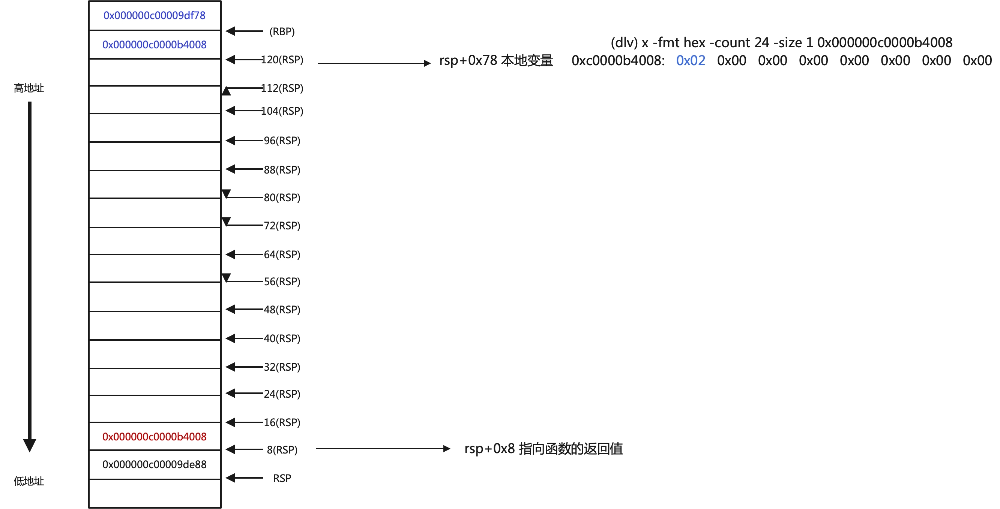

# go常用功能对应的汇编指令
## 变量声明
```go
     5:	func main() {
=>   6:		var a int
     7:		a = 2
```

通过`dlv`的`disass`查看对应的汇编指令:
```shell
    	var.go:6	0x10cbacf	488d05aaae0000			lea rax, ptr [rip+0xaeaa]         #lea 取地址，[rip+0xaeaa]对应的地址的值赋给rax([rip+0xaeaa]代表地址)
	var.go:6	0x10cbad6	48890424			mov qword ptr [rsp], rax          #把rax存储的值赋给[rsp]指向地址的值 *rsp = rax
	var.go:6	0x10cbada	e88122f4ff			call $runtime.newobject           #调用runtime.newobject函数，call <label>
	var.go:6	0x10cbadf	488b442408			mov rax, qword ptr [rsp+0x8]      # 调用newobject函数后的返回值存储在[rsp+0x8]，rax接收返回值(地址)
	var.go:6	0x10cbae4	4889442478			mov qword ptr [rsp+0x78], rax     # 使用局部变量[rsp+0x78]来接收newobject的返回值
	var.go:6	0x10cbae9	48c70000000000			mov qword ptr [rax], 0x0          # a = 0 ,[rax]代表的不是地址，而是rax指向地址的值
	var.go:7	0x10cbaf0	488b442478			mov rax, qword ptr [rsp+0x78]     # 把[rsp+0x78]存储的内容加载到rax
	var.go:7	0x10cbaf5	48c70002000000			mov qword ptr [rax], 0x2          # 把rax地址对应的值赋于2
```
通过`dlv`的`si`进行汇编级调试,首先使用`regs`查看寄存器的状态

```
var.go:6	0x10cbacf	488d05aaae0000		lea rax, ptr [rip+0xaeaa]
var.go:6	0x10cbad6	48890424		mov qword ptr [rsp], rax 
```
代码执行后的变化
```shell
   Rip = 0x00000000010cbacf  =>  Rip = 0x00000000010cbad6  #代码地址移到下一行 0x10cbad6    
   Rsp = 0x000000c00009de88  =>  Rsp = 0x000000c00009de88  # 
   Rax = 0x000000c00009df08  =>  Rax = 0x00000000010d6980  #保存代码地址0x10d6980
   Rbp = 0x000000c00009df78  =>  Rbp = 0x000000c00009df78

// rip = 0x00000000010cbacf  [rip+0xaeaa]对应的地址为`0x10d6979`
(dlv) x -fmt hex -count 24 -size 1 0x10d6979

// lea rax, ptr [rip+0xaeaa] 
(dlv) x -fmt hex -count 24 -size 1 0x000000c00009de88
0xc000065e88:   0x00   0x00   0x00   0x00   0x00   0x00   0x00   0x00

//mov qword ptr [rsp], rax 
(dlv) x -fmt hex -count 24 -size 1 0x000000c00009de88
0xc000065e88:   0x80   0x69   0x0d   0x01   0x00   0x00   0x00   0x00   //0x10d6980

(dlv) disass -a 0x10d6980 0x10d6988
	.:0	0x10d6980	0800	or byte ptr [rax], al
	.:0	0x10d6982	0000	add byte ptr [rax], al
	.:0	0x10d6984	0000	add byte ptr [rax], al
	.:0	0x10d6986	0000	add byte ptr [rax], al
```

```
	var.go:6	0x10cbad6	48890424			    mov qword ptr [rsp], rax
```
代码执行后的变化
```
Rip = 0x00000000010cbad6  =>   Rip = 0x00000000010cbada
Rsp = 0x000000c000065e88  =>   Rsp = 0x000000c000065e88
Rax = 0x00000000010d6980  =>   Rax = 0x00000000010d6980
Rbp = 0x000000c000065f78  =>   Rbp = 0x000000c000065f78
```

可以看到声明变量的时候，编译器调用了`runtime.newobject`，函数返回为内存地址。使用`dlv`查看函数跳转的地址
```
(dlv) print &runtime.newobject
(*)(0x100dd60)

(dlv) disass -a 0x100dd60 0x100dd66
TEXT runtime.newobject(SB) /usr/local/go/src/runtime/malloc.go
	malloc.go:1176	0x100dd60	65	gs
	malloc.go:1176	0x100dd61	48	rex.w
	malloc.go:1176	0x100dd62	8b	prefix(0x8b)
	malloc.go:1176	0x100dd63	0c25	or al, 0x25
	malloc.go:1176	0x100dd65	30	prefix(0x30)

# /usr/local/go/src/runtime/malloc.go:1176
        // implementation of new builtin
        // compiler (both frontend and SSA backend) knows the signature
        // of this function
1176:   func newobject(typ *_type) unsafe.Pointer {
1177:   	return mallocgc(typ.size, typ, true)
1178:   }
```

```
	var.go:6	0x10cbadf	488b442408			    mov rax, qword ptr [rsp+0x8]
```
执行之后的值
```
Rip = 0x00000000010cbadf  =>      Rip = 0x00000000010cbae4    
Rsp = 0x000000c000065e88  =>      Rsp = 0x000000c000065e88   
Rax = 0x000000c00009e000  =>      Rax = 0x000000c00009e000   
Rbp = 0x000000c000065f78  =>      Rbp = 0x000000c000065f78
```
这种可以看出`rsp`的地址为`0xc000065e88`，`[rsp+0x8]`的值为`0xc000065e90`，查看`[rsp+0x8]`的内容是`0xc00009e000`
```
(dlv) x -fmt hex -count 24 -size 1 0x000000c000065e90
0xc000065e90:   0x00   0xe0   0x09   0x00   0xc0   0x00   0x00   0x00   
0xc000065e98:   0x28   0x27   0x03   0x00   0xc0   0x00   0x00   0x00   
0xc000065ea0:   0xf5   0xd7   0x00   0x01   0x00   0x00   0x00   0x00
```

`mov rax, qword ptr [rsp+0x8]`的含义就是把`[rsp+0x8]`地址存储的内容赋给`rax`  

以下执行的代码解释
```shell
	var.go:7	0x10cbaf0	488b442478			mov rax, qword ptr [rsp+0x78]
	var.go:7	0x10cbaf5	48c70002000000			mov qword ptr [rax], 0x2
```

  

```go
=>   9:		b := new(int)
    10:		b = &a
    11:		*b = 5
```

汇编指令:  
```shell
=>	var.go:9	0x10cbafc	488d057dae0000		lea rax, ptr [rip+0xae7d]    
	var.go:9	0x10cbb03	48890424		mov qword ptr [rsp], rax
	var.go:9	0x10cbb07	e85422f4ff		call $runtime.newobject        #创建对象
	var.go:9	0x10cbb0c	488b442408		mov rax, qword ptr [rsp+0x8]   #接收返回值[rsp+0x8]，放在rax中
	var.go:9	0x10cbb11	4889442448		mov qword ptr [rsp+0x48], rax  #再把返回值放在本地变量[rsp+0x48]中
	var.go:10	0x10cbb16	488b442478		mov rax, qword ptr [rsp+0x78]  #首先是取[rsp+0x78]地址的内容
	var.go:10	0x10cbb1b	4889442448		mov qword ptr [rsp+0x48], rax  # b = &a
	var.go:11	0x10cbb20	8400			test byte ptr [rax], al        # 
	var.go:11	0x10cbb22	48c70005000000		mov qword ptr [rax], 0x5       # *b = 5
```


```
=>  13:		s := make([]int, 6)
    14:		s[0] = 2
```

创建数组调用`func makeslice(et *_type, len, cap int) unsafe.Pointer`，需要传入参数`len`和`cap`,返回一个地址指针`int`
```
=>	var.go:13	0x10cbb29	488d0550ae0000		        lea rax, ptr [rip+0xae50]
	var.go:13	0x10cbb30	48890424			mov qword ptr [rsp], rax
	var.go:13	0x10cbb34	48c744240806000000	        mov qword ptr [rsp+0x8], 0x6    # len长度参数
	var.go:13	0x10cbb3d	48c744241006000000	        mov qword ptr [rsp+0x10], 0x6   # cap容量参数
	var.go:13	0x10cbb46	e85550f8ff			call $runtime.makeslice
	var.go:13	0x10cbb4b	488b442418			mov rax, qword ptr [rsp+0x18]   # 返回值unsafe.Pointer
	var.go:13	0x10cbb50	4889842480000000	        mov qword ptr [rsp+0x80], rax   #使用[rsp+0x80]接收返回值
	var.go:13	0x10cbb58	48c784248800000006000000	mov qword ptr [rsp+0x88], 0x6   #使用[rsp+0x88]存储len
	var.go:13	0x10cbb64	48c784249000000006000000	mov qword ptr [rsp+0x90], 0x6   #使用[rsp+0x90]存储cap
	var.go:14	0x10cbb70	eb00				jmp 0x10cbb72
	var.go:14	0x10cbb72	48c70002000000		        mov qword ptr [rax], 0x2        # s[0] = 2
```

使用`dlv`查看数组的值
```
(dlv) print &s
(*[]int)(0xc000111f08)

(dlv) x -fmt hex -count 24 -size 1 0xc000111f08
0xc000111f08:   0x30   0x60   0x12   0x00   0xc0   0x00   0x00   0x00   # 数组的地址arr = 0xc000126030
0xc000111f10:   0x06   0x00   0x00   0x00   0x00   0x00   0x00   0x00   # len = 0x06
0xc000111f18:   0x06   0x00   0x00   0x00   0x00   0x00   0x00   0x00   # cap = 0x06

(dlv) x -fmt hex -count 24 -size 1 0xc000126030
0xc000126030:   0x02   0x00   0x00   0x00   0x00   0x00   0x00   0x00   # 数组的首个元素 0x02
0xc000126038:   0x00   0x00   0x00   0x00   0x00   0x00   0x00   0x00   
0xc000126040:   0x00   0x00   0x00   0x00   0x00   0x00   0x00   0x00
```

```
=>  16:		c := make(chan int, 5)
    17:		c <- 3
```
调用的函数`func makechan(t *chantype, size int) *hchan`
```
=>	var.go:16	0x10cbb79	488d0500a80000		lea rax, ptr [rip+0xa800]
	var.go:16	0x10cbb80	48890424		mov qword ptr [rsp], rax
	var.go:16	0x10cbb84	48c744240805000000	mov qword ptr [rsp+0x8], 0x5    # size 5
	var.go:16	0x10cbb8d	e80e90f3ff		call $runtime.makechan          
	var.go:16	0x10cbb92	488b442410		mov rax, qword ptr [rsp+0x10]   # 返回值*hchan
	var.go:16	0x10cbb97	4889442440		mov qword ptr [rsp+0x40], rax   # 使用[rsp+0x40]保存makechan函数返回值
	var.go:17	0x10cbb9c	48890424		mov qword ptr [rsp], rax        # func chansend1(c *hchan, elem unsafe.Pointer) 第一个参数*hchan
	var.go:17	0x10cbba0	488d05011b0300		lea rax, ptr [rip+0x31b01]      # 0x00000000010fd6a8 代表的是3
	var.go:17	0x10cbba7	4889442408		mov qword ptr [rsp+0x8], rax 
	var.go:17	0x10cbbac	e82f93f3ff		call $runtime.chansend1         # 开始发送数据
```

`[rip+0x31b01]`代表常量`3`
```
(dlv) x -fmt hex -count 24 -size 1 0x00000000010fd6a8
0x10fd6a8:   0x03   0x00   0x00   0x00   0x00   0x00   0x00   0x00   
0x10fd6b0:   0x16   0x00   0x00   0x00   0x00   0x00   0x00   0x00   
0x10fd6b8:   0x15   0x00   0x00   0x00   0x00   0x00   0x00   0x00
```


```
=>  31:		man := Man{}
    32:		var manImpl IMan
    33:		manImpl = &man
```

```
=>	var.go:31	0x10cbc45*	488d05f4160100		ea rax, ptr [rip+0x116f4]                   #指向*_type参数
	var.go:31	0x10cbc4c	48890424		mov qword ptr [rsp], rax                    #
	var.go:31	0x10cbc50	e80b21f4ff		call $runtime.newobject
	var.go:31	0x10cbc55	488b7c2408		mov rdi, qword ptr [rsp+0x8]                #newobject返回值
	var.go:31	0x10cbc5a	4889bc2488000000	mov qword ptr [rsp+0x88], rdi               #使用[rsp+0x88]接收返回值
	var.go:31	0x10cbc62	48c7470800000000	mov qword ptr [rdi+0x8], 0x0                #置零
	var.go:31	0x10cbc6a	833d7f670d0000		cmp dword ptr [runtime.writeBarrier], 0x0   
	var.go:31	0x10cbc71	7405			jz 0x10cbc78
	var.go:31	0x10cbc73	e9bc020000		jmp 0x10cbf34
	var.go:31	0x10cbc78	48c70700000000		mov qword ptr [rdi], 0x0
	var.go:31	0x10cbc7f	90			nop
	var.go:31	0x10cbc80	eb00			jmp 0x10cbc82
	var.go:32	0x10cbc82	0f57c0			xorps xmm0, xmm0
	var.go:32	0x10cbc85	0f11842498000000	movups xmmword ptr [rsp+0x98], xmm0         #本地变量[rsp+0x98]
	var.go:33	0x10cbc8d	488b842488000000	mov rax, qword ptr [rsp+0x88]               #man的地址赋给rax
	var.go:33	0x10cbc95	4889442458		mov qword ptr [rsp+0x58], rax               #
	var.go:33	0x10cbc9a	488d0d17370300		lea rcx, ptr [rip+0x33717]
	var.go:33	0x10cbca1	48898c2498000000	mov qword ptr [rsp+0x98], rcx
	var.go:33	0x10cbca9	48898424a0000000	mov qword ptr [rsp+0xa0], rax               #接口指针.data = &man
```


## 函数调用

```
     5:	func main() {
=>   6:		b := 8
     7:		c := callMe(b)
     8:		fmt.Println(c)
     9:	}
    10:	
    11:	func callMe(a int) int {
    12:	    return a + 5
    13:}
```

```
(dlv) print &main.callMe
(*)(0x10cbba0)

=>	func.go:6	0x10cbac1	48c744243808000000	mov qword ptr [rsp+0x38], 0x8
	func.go:7	0x10cbaca	48c7042408000000	mov qword ptr [rsp], 0x8       #rsp作为第一个参数8
	func.go:7	0x10cbad2	e8c9000000		call $main.callMe              
	func.go:7	0x10cbad7	488b442408		mov rax, qword ptr [rsp+0x8]   #rax接收返回值
	func.go:7	0x10cbadc	4889442430		mov qword ptr [rsp+0x30], rax  #本地变量c就是[rsp+0x30]接收返回值  
	
(dlv) disass -a 0x10cbba0 0x10cbbc0
TEXT main.callMe(SB) /Users/ymm/work/mygithub/go-build/code/go/assembly/func/func.go
	func.go:11	0x10cbba0	48c744241000000000	mov qword ptr [rsp+0x10], 0x0   # 返回值
	func.go:12	0x10cbba9	488b442408		mov rax, qword ptr [rsp+0x8]    # 第一个参数
	func.go:12	0x10cbbae	4883c005		add rax, 0x5
	.:0		0x10cbbb2	4889442410		mov qword ptr [rsp+0x10], rax   # 把结果放到返回值中
	.:0		0x10cbbb7	c3			ret                             # 返回
	.:0		0x10cbbb8	0000			add byte ptr [rax], al
	.:0		0x10cbbba	0000			add byte ptr [rax], al
	.:0		0x10cbbbc	0000			add byte ptr [rax], al
	.:0		0x10cbbbe	0000			add byte ptr [rax], al
```

